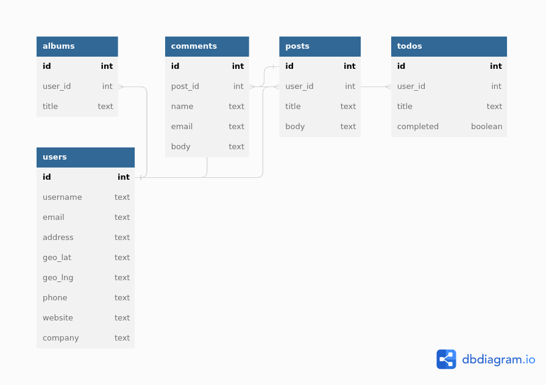

# Golang Challenge

## Resume
This project provides a solution for the Golang Challenge, which involves making a request to the free fake API at https://jsonplaceholder.typicode.com/users, processing the API response, and storing the data in a database. The project is written in Go and demonstrates proficiency in working with HTTP requests, JSON parsing, and database interactions.

## Configuration
You can find database configuration in configuration.json file.

## Running
```
# Install dependencies
go mod download

# Run the project
go run main.go
```

## Testing
```
go test pkg/db/queries_test.go
```

## ER

